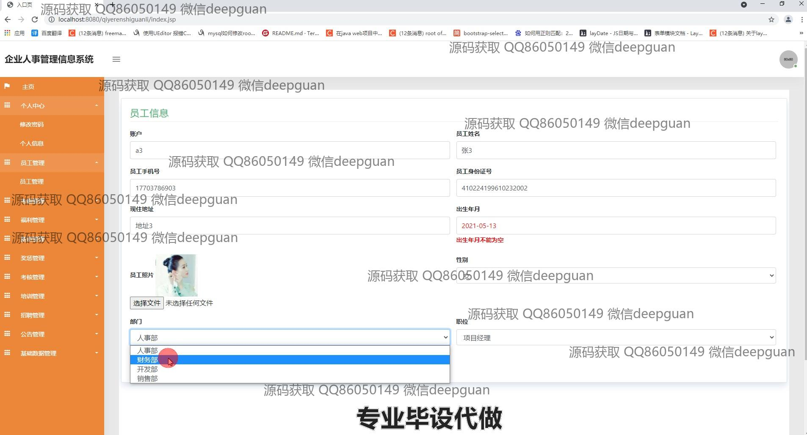

<h1 align="center">基于JavaEE的企业人事管理信息系统的设计与实现</h1>

## 简介
企业人事管理信息系统：角色分为管理员、员工；功能包括员工管理、考勤管理、薪资管理、奖惩管理、福利管理、培训管理等模块，实现企业人力资源高效管理。    --计算机毕业设计源码；毕设源码；java毕业设计源码

## 联系方式

<h3 align="center">获取完整代码与数据库文件 + 微信：deepguan QQ: 86050149 QQ群: 783742310</h3>

<h3 align="center">可帮忙远程部署 包运行成功！提供远程部署、修改代码、设计文档指导、代码讲解等服务！</h3>

## 功能介绍（完整见运行截图）
管理员：管理员可以通过系统访问不同模块，包括员工管理、考勤管理、薪资管理、培训管理等。登录后，管理员可以新增、修改和删除员工信息，管理员工考勤记录，管理员工薪资信息，分配和记录培训计划。系统还提供福利管理、奖惩管理和公告发布等功能，帮助管理员高效管理企业人事信息，确保数据安全和操作权限的合理分配。

普通用户：用户可以查看和编辑个人信息，参与考勤打卡并查看考勤记录，了解自己的薪资和福利情况。通过培训模块，用户可以查看已分配的培训课程并参与学习。用户界面提供的导航菜单使得访问不同功能模块更加便捷，用户可以随时查看自己的奖惩记录和个人中心信息，提升了自身信息的透明度和操作的便捷性。

## 运行截图

本代码来源于网络,仅供学习参考使用!

